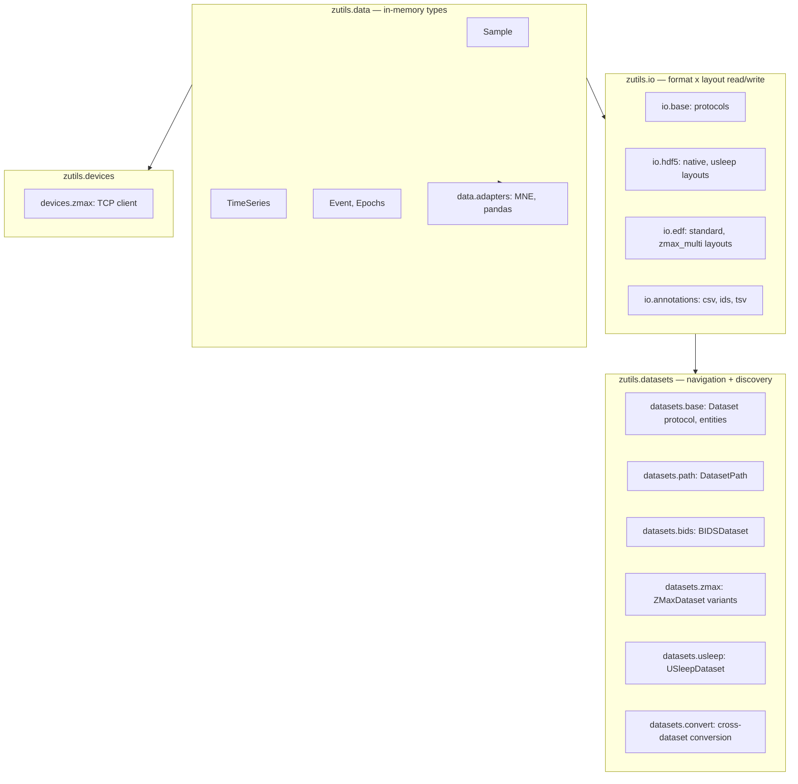
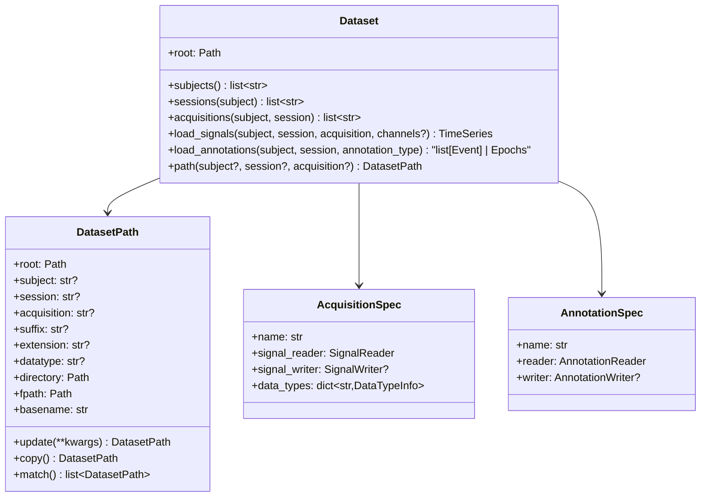
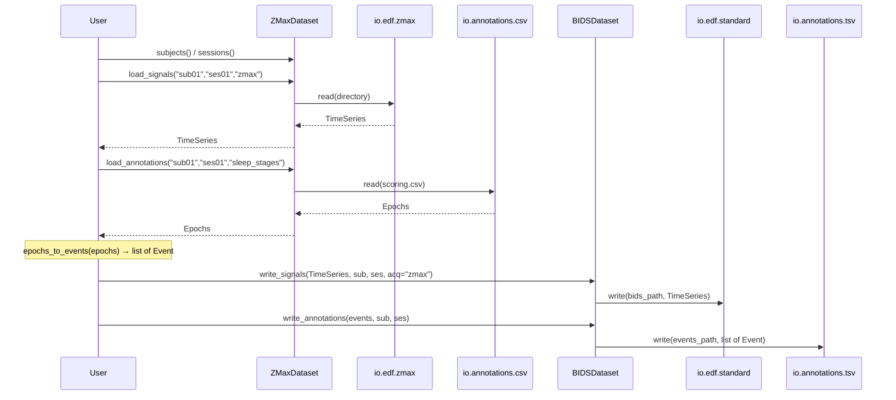

# Part A — zutils complete design

## 1. Architecture overview




**Dependency direction:** `data` (no deps beyond numpy) ← `io` (h5py, mne optional) ← `datasets` (uses io) ← `devices` (uses data only). `data.adapters` depends only on core data types.

---

## 2. `zutils.data` — in-memory types

### 2a. Existing (done): `Sample`, `TimeSeries`, `concat`, `collect_samples`

Already implemented in `[src/zutils/data/timeseries.py](src/zutils/data/timeseries.py)`. No changes needed.

### 2b. New: Annotation types (`data/annotations.py`)

#### Design rationale — MNE already covers a lot

MNE's `mne.Annotations` already has `onset`, `duration`, `description`, and an `extras` list of dicts for per-annotation arbitrary metadata. For `TimeSeries`, MNE's `mne.io.Raw` assumes fixed sample rate — that is why zutils has its own `TimeSeries` (irregular sampling, streaming). For annotations, the gap is smaller: the main reasons zutils still needs its own types are:

- MNE is an **optional** heavy dependency — core zutils code (I/O, datasets) must work without it.
- Sleep studies use **fixed-period epoch labels** (e.g., 30-second sleep stages) as a first-class concept. MNE's `mne.Epochs` is segmented timeseries data around events — a totally different thing.
- We want a single `Event` object with arbitrary properties, not just parallel arrays.

The adapter in `data.adapters.mne` bridges `list[Event]` to/from `mne.Annotations` losslessly.

#### `Event` — the core annotation type

```python
@dataclass
class Event:
    """A single annotated occurrence with arbitrary properties.

    Attributes:
        onset: Start time in seconds from recording start.
        duration: Duration in seconds (0.0 for instantaneous events).
        description: Event type/label (e.g., "N2", "arousal", "stimulus").
        extras: Arbitrary per-event metadata (e.g., {"confidence": 0.95}).
    """
    onset: float
    duration: float
    description: str
    extras: dict[str, Any] = field(default_factory=dict)
```

A **sequence of events** is simply `list[Event]` — no wrapper class needed. Sort, filter, and group with standard Python.

#### `Epochs` — convenience for fixed-period label arrays

Sleep scoring universally produces a flat array of labels at a fixed period (e.g., one label per 30 seconds). `Epochs` is a thin convenience that wraps this pattern and converts to/from `list[Event]`.

```python
@dataclass
class Epochs:
    """Fixed-period epoch annotations (e.g., 30-second sleep stages).

    Convenience type for the common pattern of one label per fixed-length window.
    Trivially convertible to/from list[Event].

    Attributes:
        labels: Label per epoch, shape (n_epochs,). String or int dtype.
        period_length: Duration of each epoch in seconds (e.g., 30.0).
        onset: Start time of the first epoch in seconds from recording start.
    """
    labels: np.ndarray       # (n_epochs,) dtype object (strings) or int
    period_length: float     # seconds
    onset: float = 0.0       # seconds from recording start
```

#### Helpers

- `epochs_to_events(epochs: Epochs) -> list[Event]` — expand each label to an `Event` with the computed onset/duration.
- `events_to_epochs(events: list[Event], period_length: float) -> Epochs` — collapse contiguous fixed-duration events back into label array.

### 2c. `data/adapters/`

- `mne.py` — `to_mne_raw` / `from_mne_raw` for `TimeSeries`; `to_mne_annotations(events: list[Event]) -> mne.Annotations` / `from_mne_annotations(annot: mne.Annotations) -> list[Event]` (maps `extras` both ways since MNE supports it natively).
- `pandas.py` — `to_dataframe` / `from_dataframe` for `TimeSeries`; `events_to_dataframe(events: list[Event]) -> pd.DataFrame` / `dataframe_to_events(df) -> list[Event]`.

### 2d. Re-exports from `data/__init__.py`

```python
from zutils.data.timeseries import Sample, TimeSeries, concat, collect_samples
from zutils.data.annotations import Event, Epochs, epochs_to_events, events_to_epochs
```

---

## 3. `zutils.io` — format x layout read/write

The I/O layer is organized by **what you're reading/writing** (signals vs annotations) and **which format+layout combination**.

### 3a. Protocols (`io/base.py`)

```python
from typing import Protocol

class SignalReader(Protocol):
    """Reads signal data from disk in a specific format+layout."""
    def read(self, path: Path, **kwargs) -> TimeSeries: ...

class SignalWriter(Protocol):
    """Writes signal data to disk in a specific format+layout."""
    def write(self, path: Path, data: TimeSeries, **kwargs) -> None: ...

class AnnotationReader(Protocol):
    """Reads annotations from disk in a specific format+layout."""
    def read(self, path: Path, **kwargs) -> list[Event] | Epochs: ...

class AnnotationWriter(Protocol):
    """Writes annotations to disk in a specific format+layout."""
    def write(self, path: Path, data: list[Event] | Epochs, **kwargs) -> None: ...
```

These are **stateless** — a reader/writer instance is configured once (with layout-specific options) and can read/write multiple files.

### 3b. HDF5 signal layouts (`io/hdf5/`)

Each layout is a module exporting a reader and writer that conform to the protocols above.

- `**io/hdf5/native.py`** — Native zutils HDF5 layout
  - Groups: `/{group_name}/data` (float64), `/{group_name}/timestamp` (int64)
  - Group attrs: `channel_names`, `units`, `sample_rate`
  - `read(path, group=None) -> TimeSeries` (single group) or `read_all(path) -> dict[str, TimeSeries]`
  - `write(path, data, group_name)` — one-shot write
  - `serialize(obj) -> (datasets_dict, attrs_dict)` / `deserialize(...)` — used by slumber's HDF5Manager for streaming append
- `**io/hdf5/usleep.py`** — USleep/zmax-datasets export layout
  - Groups: `/channels/{channel_name}` as datasets; file-level attr `sample_rate`
  - Derived from `USleepExportStrategy._write_data_to_hdf5` in zmax-datasets
  - Reader + writer

### 3c. EDF signal layouts (`io/edf/`)

- `**io/edf/standard.py`** — Single multiplexed EDF file
  - `read(path) -> TimeSeries` — may use MNE internally; applies SI scaling
  - `write(path, data) -> None`
- `**io/edf/zmax.py`** — ZMax per-channel EDF directory
  - `read(path, data_types=None) -> TimeSeries` — reads `{stem}.edf` per channel, stacks
  - Maps `DataType` enum → EDF file stems (e.g., `"EEG L"`, `"dX"`)
  - Applies SI scaling (MNE reads in V; no ×1e6 like legacy)

### 3d. Annotation I/O (`io/annotations/`)

- `**io/annotations/csv.py`** — ZMax-style scoring CSV (space/tab-separated integers, no header)
  - `read(path, column, label_mapping=None) -> Epochs` (epoch labels at fixed period)
  - `write(path, epochs) -> None`
- `**io/annotations/ids.py`** — USleep IDS format (run-length encoded `initial,duration,stage`)
  - `read(path, period_length=30.0) -> Epochs`
  - `write(path, epochs) -> None`
- `**io/annotations/tsv.py`** — BIDS `*_events.tsv` (onset, duration, trial_type, extra columns)
  - `read(path) -> list[Event]` (extra TSV columns map to `Event.extras`)
  - `write(path, events: list[Event]) -> None`

### 3e. Package tree

```
io/
├── __init__.py
├── base.py               # SignalReader/Writer, AnnotationReader/Writer protocols
├── hdf5/
│   ├── __init__.py
│   ├── native.py          # Native zutils HDF5 layout
│   └── usleep.py          # USleep channels HDF5 layout
├── edf/
│   ├── __init__.py
│   ├── standard.py        # Single-file multiplexed EDF
│   └── zmax.py            # ZMax per-channel EDF directory
└── annotations/
    ├── __init__.py
    ├── csv.py             # ZMax scoring CSV
    ├── ids.py             # USleep IDS run-length encoding
    └── tsv.py             # BIDS events TSV
```

---

## 4. `zutils.datasets` — BIDSPath-inspired navigation and loading

This is the biggest conceptual change. The key insight: **a dataset is a directory tree where entities (subject, session, acquisition) map to paths via a structure convention**. Inspired by MNE-BIDS's `BIDSPath`, but generalized for non-BIDS layouts.

### 4a. Core model




### 4b. `DatasetPath` (`datasets/path.py`)

Inspired by `[mne_bids.BIDSPath](https://mne.tools/mne-bids/stable/generated/mne_bids.BIDSPath.html)`. An immutable-ish entity bag + path resolver. The path-resolution logic is **pluggable** — each `Dataset` subclass provides a resolver.

```python
@dataclass
class DatasetPath:
    """Entity-based path into a dataset, inspired by mne_bids.BIDSPath.

    Entities are optional; when set, they narrow the path.
    Path resolution depends on the dataset's structure convention.
    """
    root: Path
    subject: str | None = None
    session: str | None = None
    acquisition: str | None = None
    datatype: str | None = None     # e.g. "eeg", "physio"
    suffix: str | None = None       # e.g. "eeg", "channels", "events"
    extension: str | None = None    # e.g. ".edf", ".tsv", ".h5"
    _resolver: PathResolver | None = field(default=None, repr=False)

    @property
    def directory(self) -> Path: ...     # resolved directory for these entities
    @property
    def fpath(self) -> Path: ...         # full file path (directory + basename)
    @property
    def basename(self) -> str: ...       # filename portion

    def update(self, **kwargs) -> DatasetPath: ...  # returns new with updated entities
    def copy(self) -> DatasetPath: ...
    def match(self) -> list[DatasetPath]: ...  # glob for matching paths in root
```

`**PathResolver` protocol:** maps entities → directory and filename. BIDS has one resolver (the standard `sub-XX/ses-XX/datatype/` convention); ZMax datasets have another (e.g., `{subject}/{session}/` with EDF files inside).

### 4c. `Dataset` protocol and base (`datasets/base.py`)

```python
class Dataset(Protocol):
    """A structured collection of recordings organized by subject/session/acquisition."""

    @property
    def root(self) -> Path: ...

    def subjects(self) -> list[str]: ...
    def sessions(self, subject: str) -> list[str]: ...
    def acquisitions(self, subject: str, session: str) -> list[str]: ...

    def load_signals(
        self,
        subject: str,
        session: str,
        acquisition: str,
        channels: list[str] | None = None,
    ) -> TimeSeries: ...

    def load_annotations(
        self,
        subject: str,
        session: str,
        annotation_type: str,        # e.g. "sleep_stages", "events"
        acquisition: str | None = None,
    ) -> list[Event] | Epochs: ...

    def path(
        self,
        subject: str | None = None,
        session: str | None = None,
        acquisition: str | None = None,
        **kwargs,
    ) -> DatasetPath: ...
```

`**BaseDataset**` (abstract class implementing common logic):

- Holds `root`, `acquisition_specs: dict[str, AcquisitionSpec]`, `annotation_specs: dict[str, AnnotationSpec]`
- `load_signals` resolves spec → reader → path → read
- `load_annotations` resolves spec → reader → path → read
- Subclasses override: `subjects()`, `sessions()`, `acquisitions()`, path resolver, and how to derive entities from directory structure

### 4d. `AcquisitionSpec` and `AnnotationSpec`

```python
@dataclass
class DataTypeInfo:
    """Metadata about one channel/signal type within an acquisition."""
    channel: str           # canonical channel name (e.g., "EEG_L")
    unit: str              # SI symbol (e.g., "V")
    sample_rate: float     # Hz

@dataclass
class AcquisitionSpec:
    """Defines how one modality's signals are stored on disk."""
    name: str                           # e.g., "zmax", "psg", "polar"
    signal_reader: SignalReader
    signal_writer: SignalWriter | None = None
    data_types: dict[str, DataTypeInfo] = field(default_factory=dict)

@dataclass
class AnnotationSpec:
    """Defines how one annotation type is stored on disk."""
    name: str                           # e.g., "sleep_stages", "arousals", "events"
    reader: AnnotationReader
    writer: AnnotationWriter | None = None
    label_mapping: dict[int, str] | None = None  # e.g., {0: "W", 1: "N1", ...}
```

### 4e. Concrete dataset implementations

`**ZMaxDataset**` (`datasets/zmax.py`):

- Structure: `{root}/{subject_dir}/{session_dir}/` containing per-channel `.edf` files
- Subject/session derived from directory names (configurable regex/pattern, like zmax-datasets' `_extract_ids_from_zmax_dir`)
- Acquisition: "zmax" with `io.edf.zmax` reader
- Annotations: CSV scoring file (configurable path pattern) with `io.annotations.csv` reader

`**USleepDataset**` (`datasets/usleep.py`):

- Structure: `{root}/{recording_id}/` containing `{recording_id}.h5` + `{recording_id}.ids`
- Subject/session parsed from recording_id (configurable separator)
- Acquisition: default with `io.hdf5.usleep` reader
- Annotations: IDS file with `io.annotations.ids` reader

`**BIDSDataset**` (`datasets/bids.py`):

- Structure: standard BIDS `sub-XX/ses-XX/{datatype}/` layout
- `DatasetPath` uses BIDS path resolver (entity-encoded filenames)
- Reads `dataset_description.json`, `participants.tsv`
- Acquisitions mapped via BIDS `acq-` entity; modality from `datatype`
- Signals: `io.edf.standard` (or other based on extension)
- Annotations: `io.annotations.tsv` for `*_events.tsv`

`**SlumberDataset**` (`datasets/slumber.py`):

- Structure: Slumber run directories with `storage.h5`
- Groups in HDF5 = different acquisitions ("zmax_raw", "zmax_preprocessed", etc.)
- Signals: `io.hdf5.native` reader
- Annotations/events: `events.jsonl` → `list[Event]`

### 4f. Dataset conversion (`datasets/convert.py`)

Since every `Dataset` speaks the same protocol, conversion is generic:

```python
def convert(
    source: Dataset,
    target_root: Path,
    target_type: type[Dataset],  # e.g., BIDSDataset
    subjects: list[str] | None = None,
    sessions: list[str] | None = None,
    acquisitions: list[str] | None = None,
    annotation_types: list[str] | None = None,
    **target_kwargs,
) -> Dataset:
    """Convert data from source dataset layout to target dataset layout.

    Iterates subjects/sessions/acquisitions in source, loads signals + annotations,
    writes them via target dataset's writers.
    """
```

This makes **ZMax → BIDS** or **BIDS → USleep** a one-liner (given configured specs).

### 4g. Package tree

```
datasets/
├── __init__.py
├── base.py            # Dataset protocol, BaseDataset, AcquisitionSpec, AnnotationSpec, DataTypeInfo
├── path.py            # DatasetPath, PathResolver protocol
├── bids.py            # BIDSDataset (read + write BIDS)
├── zmax.py            # ZMaxDataset variants (Karolinska, Donders, etc.)
├── usleep.py          # USleepDataset
├── slumber.py         # SlumberDataset (HDF5 run dirs)
└── convert.py         # Generic dataset-to-dataset conversion
```

---

## 5. `zutils.devices.zmax` — live device communication (unchanged)

Port from legacy. Orthogonal to datasets: uses `data.Sample` for output.

- `ZMax` TCP client, `DataType` enum (with SI scale functions), `LEDColor`, stimulation helpers, protocol parsing.
- Path: `devices/zmax/` with `client.py`, `enums.py`, `protocol.py`, `constants.py`.

---

## 6. Complete package tree

```
src/zutils/
├── __init__.py
├── data/
│   ├── __init__.py           # re-exports all core types
│   ├── timeseries.py         # Sample, TimeSeries, concat, collect_samples (DONE)
│   ├── annotations.py        # Event, Epochs, epochs_to_events, events_to_epochs (NEW)
│   └── adapters/
│       ├── __init__.py
│       ├── mne.py            # TimeSeries ↔ mne.io.Raw; list[Event] ↔ mne.Annotations
│       └── pandas.py         # TimeSeries ↔ DataFrame; list[Event] ↔ DataFrame
│
├── io/
│   ├── __init__.py
│   ├── base.py               # SignalReader/Writer, AnnotationReader/Writer protocols
│   ├── hdf5/
│   │   ├── __init__.py
│   │   ├── native.py         # Native zutils HDF5: data/timestamp groups + attrs; serialize/deserialize
│   │   └── usleep.py         # USleep: /channels/{name} + sample_rate attr
│   ├── edf/
│   │   ├── __init__.py
│   │   ├── standard.py       # Single multiplexed EDF read/write
│   │   └── zmax.py           # ZMax per-channel EDF directory read/write
│   └── annotations/
│       ├── __init__.py
│       ├── csv.py            # ZMax scoring CSV (integers, no header)
│       ├── ids.py            # USleep IDS (run-length encoded)
│       └── tsv.py            # BIDS events TSV (onset, duration, trial_type)
│
├── datasets/
│   ├── __init__.py
│   ├── base.py               # Dataset protocol, BaseDataset, AcquisitionSpec, AnnotationSpec
│   ├── path.py               # DatasetPath + PathResolver protocol
│   ├── bids.py               # BIDSDataset
│   ├── zmax.py               # ZMaxDataset (configurable ID extraction)
│   ├── usleep.py             # USleepDataset
│   ├── slumber.py            # SlumberDataset
│   └── convert.py            # Generic cross-dataset conversion
│
├── devices/
│   └── zmax/
│       ├── __init__.py
│       ├── client.py
│       ├── enums.py
│       ├── protocol.py
│       └── constants.py
│
└── cli/
    └── ...                   # existing NSRR download
```

---

## 7. Data flow examples

### ZMax study folder → BIDS




### Slumber run → analysis via adapters

```
SlumberDataset.load_signals("s01", "night1", "zmax_raw")
  → io.hdf5.native.read(storage.h5, group="zmax_raw")
  → TimeSeries
  → data.adapters.mne.to_mne_raw(ts) → mne.io.RawArray (for MNE processing)
  → data.adapters.pandas.to_dataframe(ts) → pd.DataFrame (for tabular analysis)
```

---

## 8. Key design decisions

- `**Event` is the core annotation type** — a single dataclass with `onset`, `duration`, `description`, and arbitrary `extras`. A sequence of events is just `list[Event]`. `Epochs` is a convenience for fixed-period label arrays (sleep stages) that converts to/from `list[Event]`. MNE's `mne.Annotations` already has `extras` support; the adapter bridges losslessly. We don't duplicate what MNE covers — we provide a lightweight core that works without MNE installed.
- **I/O is protocol-based**: `SignalReader`/`Writer` and `AnnotationReader`/`Writer`. Each format+layout implements these. New layouts = new module, same interface.
- **Dataset = entity discovery + I/O binding**. A dataset knows its directory structure (how to derive subject/session/acquisition from paths) and which I/O readers to use. `DatasetPath` provides BIDSPath-like entity navigation.
- **BIDS conversion is not special-cased**: it falls out from the generic `Dataset` protocol. Any dataset with readers can be converted to any dataset with writers.
- **No "Recording" abstraction**: what the old plan called "Recording" (one session from one device) is now an **(subject, session, acquisition)** tuple navigated via `Dataset`. Simpler, more BIDS-aligned.
- **HDF5Manager stays in Slumber** (not zutils). `io.hdf5.native` provides `serialize`/`deserialize` for layout encoding/decoding; Slumber's HDF5Manager uses those for realtime append.

---

## 9. Dependencies

```toml
dependencies = ["numpy>=1.24"]

[project.optional-dependencies]
hdf5 = ["h5py>=3.8"]
edf = ["mne>=1.5"]
pandas = ["pandas>=2.0"]
cli = ["loguru", "python-dotenv", "requests", "tqdm", "typer"]
```

---

## 10. Execution order for Part A

1. `**data/annotations.py**` — `Event`, `Epochs`, conversion helpers (no deps beyond numpy)
2. `**io/base.py**` — protocol definitions
3. `**io/hdf5/native.py**` + `**io/hdf5/usleep.py**` — HDF5 layouts (needs h5py)
4. `**io/edf/**` — EDF layouts (needs mne)
5. `**io/annotations/**` — CSV, IDS, TSV readers/writers (minimal deps)
6. `**datasets/path.py**` + `**datasets/base.py**` — DatasetPath, protocols, BaseDataset
7. `**datasets/zmax.py**`, `**datasets/usleep.py**`, `**datasets/slumber.py**` — concrete datasets
8. `**datasets/bids.py**` — BIDSDataset (read + write)
9. `**datasets/convert.py**` — generic conversion
10. `**data/adapters/**` — MNE, pandas bridges
11. `**devices/zmax/**` — TCP client port
12. Tests and docs alongside each step

